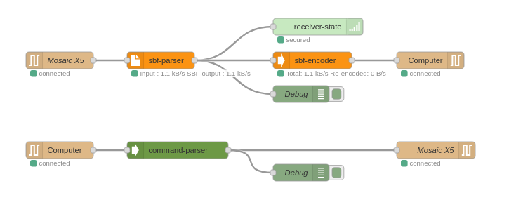
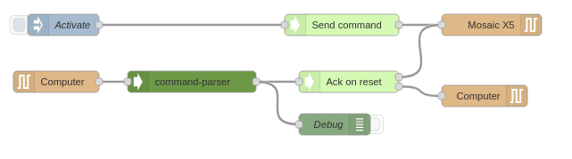
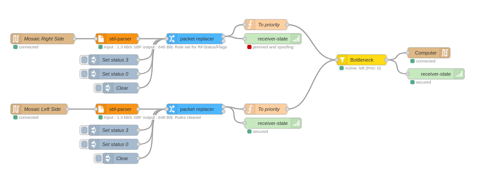
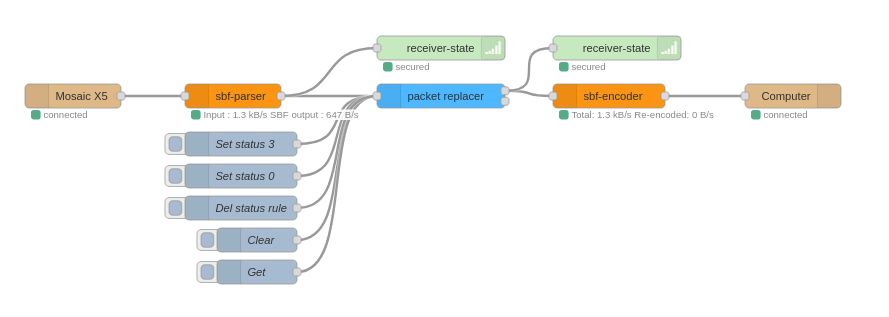
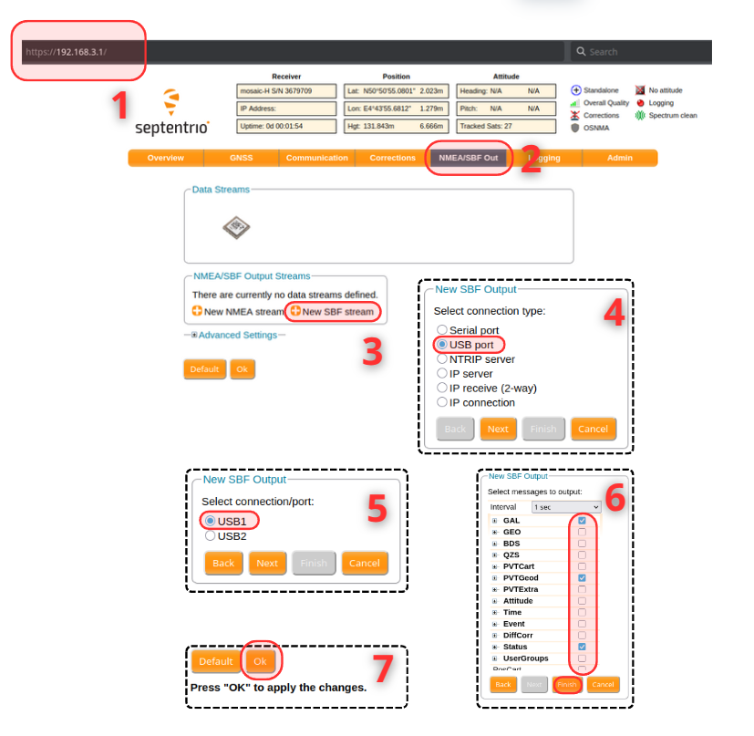
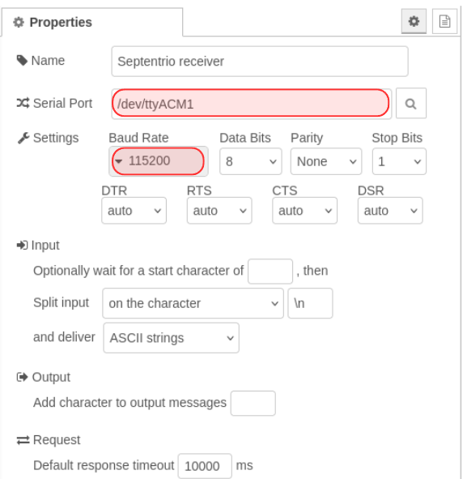
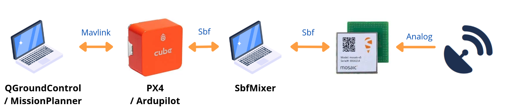
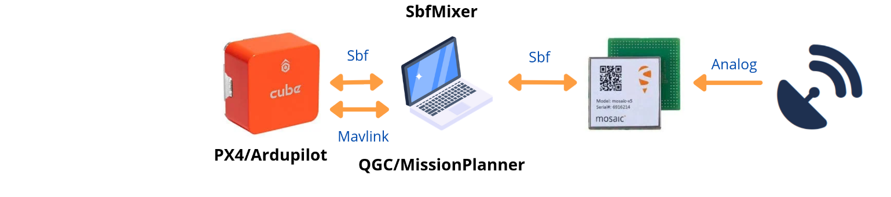

<div align="center">
  
</div>

# SbfMixer


A node-red plugin to parse, show, edit, and emulate Septentrio Receiver !

### Installation

You need to install [Sbf Parser](https://github.com/septentrio-gnss/SbfParser) to decode Sbf (Septentrio Binary Format) from the receiver.

Then, install Sbf mixer with these commands :
```bash
# Setup environment
cd ~
git clone --recurse-submodules https://github.com/septentrio-gnss/SbfMixer
cd SbfMixer

# Setup python
python3 -m venv venv
source venv/bin/activate

# Setup SbfParser
cd SbfParser
pip install -e .
cd ..

# Install packages
cd ~/.nodre-ed
npm install ~/SbfMixer
npm install node-red-node-serialport

# Run node-red if you have installed using your package manager
node-red
# Or if you have installed using `npm install node-red`
$(npm get prefix)/bin/node-red
```


## Examples

| <div align="center"><br>[Decode Sbf stream](examples/read_stream.json)</div> | <div align="center"><br>[Send and ack commands](examples/ack_and_send_commands.json)</div> |
| -------- | ------- |
| <div align="center"><br>[CRPA Configuration](examples/CRPA.json)</div> | <div align="center"><br>[Edit Sbf](examples/edit_sbf.json)</div> |


## Release note
This package contains these nodes :

Working with Sbf stream :
- `sbf_parser` : Convert binary from serial to Sbf blocks. Each message will have a `payload` argument containing the original binary of the message.
- `sbf_encoder` :  Encode each Sbf message without payload and return binary buffer ready to be output to serial connection.
- `command_parser` : Parse command send by your computer using plain text encoding
- `ack_command` : Simulate an acknowledgment from a virtual receiver.

Editing Sbf :
- `packet-replacer` : Replace value of chosen blocks
- `spoofing` : Not yet released.
- `player` : Play sbf block received according to their TOW

Utils :
- `receiver-state` : Show receiver jamming and spoofing status
- `on-change` : Send sbf block when they differ from the last one
- `bottleneck` : Allow to choose from multiple Sbf input 

You can find a longer description in `blocks_description.md`

## Tutorial
### Setup receiver

You can read SBF directly from mosaic by plugin it to your computer :
1) Go to https://192.168.3.1/ to enable the output of some SBF messages
2) Go to NMEA/SBF Out
3) Click New SBF Stream
4) Select USB Port
5) Select USB1
6) Choose your messages to output, for example, Status, PVTGeod and GAL
7) Confirm with Ok



You should now have SBF stream to your computer, you can check by using cat `/dev/ttyACM1` (could possibly be `/dev/ttyACM0`)
You can now configure your Serial block by giving it a name, an input stream (`/dev/ttyACM1`) and the baudrate (`115200`).



### Sbf Parser
The incoming stream from the serial connection use buffer of bytes. To group and decode them, you should pass it to `sbf-parser`.
This block will send the binary to the Cython [sbfParser](https://github.com/MJeanneRose/sbfParser) and return the result in a Json message. For exemple with a `ReceiverStatus` message :

```json
{
    "type":"SBF",
    "blockName":"ReceiverStatus",
    "block":{
        "blockName":"ReceiverStatus",
        "blockType":"SBF",
        "TOW":4294967295,
        "WNc":65535,
        "Temperature":141,
        "CPULoad":17,
        "RxError":8,
        ...
        "N":4,
        "AGCState":[
            {"FrontendID":0,"Gain":49,"SampleVar":102,"BlankingStat":0},
            {"FrontendID":1,"Gain":56,"SampleVar":102,"BlankingStat":0},
            {"FrontendID":11,"Gain":59,"SampleVar":102,"BlankingStat":0},
            {"FrontendID":3,"Gain":56,"SampleVar":96,"BlankingStat":0}
        ],
    },
    "payload":[36,64, ...],
    "_parsed_by":"name_of_the_parser_used",
}
```

## FAQ
### How to output to an autopilot? (CubeOrange / Pixhawk / Other)

You may need a TTL cable to emulate a serial connection, like the Septentrio receiver does with `/dev/ACM0`.
After connecting your cable, you will see a new device, usually named `/dev/ttyUSB0`, which you can use just like the one for the Septentrio receiver via a serial block.

By default, these cables can echo each input they receive. This can lead to several issues when connecting two TTL cables (infinite echo) or when connecting to an autopilot.
You can disable this behavior using:

```bash
stty -F /dev/ttyUSB0 -echo
```

### Can I use Sbf-Mixer on the same computer as my drone emulator/pilot?

The recommended setup uses a dedicated Raspberry Pi or computer to run Sbf-Mixer separately:



You may be able to use a setup like this one:



However, running QGC/MP on the same computer connected to the Mosaic will allow the ground control station to interact with the Septentrio receiver already used by the autopilot.
You can try to separate them by using Docker with: `--device=/dev/ttyUSB0`


