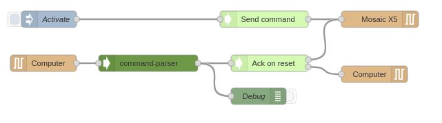
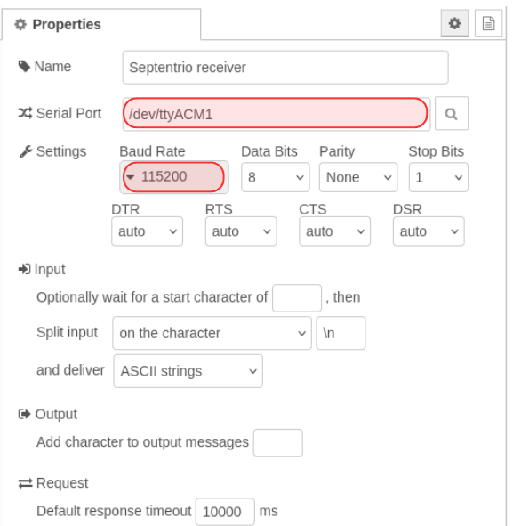

<div align="center">
  
</div>

# SbfMixer


A node-red plugin to parse, show, edit, and emulate Septentrio Receiver !

### Installation

You need to install [Sbf Parser](https://github.com/septentrio-gnss/SbfParser) to decode Sbf (Septentrio Binary Format) from the receiver.
```bash
pip install sbf-parser 
```

You can now install SbfMixer by going to:
Menu > Manage Palette > Palette > Install > Search for "mixer" > Install `@septentrio/node-red-sbf-mixer`
You must also install `node-red-node-serialport`

Or directly with npm :
```bash
cd ~/.node-red
npm install @septentrio/node-red-sbf-mixer
npm install node-red-node-serialport
```

Et voila !
If you want a steps-by-steps tutorial on SbfMixer, you can check `tutorial.md`

## Examples

You can import theses flow from `examples/` directly into Node-RED using `Menu > Import`.

| <div align="center"><br>[Decode Sbf stream](examples/read_stream.json)</div> | <div align="center"><br>[Send and ack commands](examples/ack_and_send_commands.json)</div> |
| -------- | ------- |
| <div align="center"><br>[CRPA Configuration](examples/CRPA.json)</div> | <div align="center"><br>[Edit Sbf](examples/resilience_emulator.json)</div> |


## Release note
This package contains these nodes :

Working with Sbf stream :
- `sbf_parser` : Convert binary from serial to Sbf blocks. Each message will have a `payload` argument containing the original binary of the message.
- `sbf_encoder` :  Encode each Sbf message without payload and return binary buffer ready to be output to serial connection.
- `command_parser` : Parse command send by your computer using plain text encoding
- `ack_command` : Simulate an acknowledgment from a virtual receiver.

Editing Sbf :
- `packet-replacer` : Replace value of chosen blocks
- `spoofing` : Not yet released.
- `player` : Play sbf block received according to their TOW

Utils :
- `receiver-state` : Show receiver jamming and spoofing status
- `on-change` : Send sbf block when they differ from the last one
- `bottleneck` : Allow to choose from multiple Sbf input 

## Tutorial
A full tutorial can be found in `tutorial.md`.

### Setup receiver

You can read SBF directly from mosaic by plugin it to your computer :
1) Go to https://192.168.3.1/ to enable the output of some SBF messages
2) Go to NMEA/SBF Out
3) Click New SBF Stream
4) Select USB Port
5) Select USB1
6) Choose your messages to output, for example, Status, PVTGeod and GAL
7) Confirm with Ok


You should now have SBF stream to your computer, you can check by using cat `/dev/ttyACM0` (could possibly be `/dev/ttyACM1`)
You can now configure your Serial block by giving it a name, an input stream (`/dev/ttyACM1`) and the baudrate (`115200`).



### Sbf Parser

The incoming stream from the serial connection use buffer of bytes. To group and decode them, you should pass it to `sbf-parser`.
This block will send the binary to the Cython [sbfParser](https://github.com/MJeanneRose/sbfParser) and return the result in a Json message. For exemple with a `ReceiverStatus` message :

```json
{
    "type":"SBF",
    "blockName":"ReceiverStatus",
    "block":{
        "blockName":"ReceiverStatus",
        "blockType":"SBF",
        "TOW":4294967295,
        "WNc":65535,
        "Temperature":141,
        "CPULoad":17,
        "RxError":8,
        ...
        "N":4,
        "AGCState":[
            {"FrontendID":0,"Gain":49,"SampleVar":102,"BlankingStat":0},
            {"FrontendID":1,"Gain":56,"SampleVar":102,"BlankingStat":0},
            {"FrontendID":11,"Gain":59,"SampleVar":102,"BlankingStat":0},
            {"FrontendID":3,"Gain":56,"SampleVar":96,"BlankingStat":0}
        ],
    },
    "payload":[36,64, ...],
    "_parsed_by":"name_of_the_parser_used",
}
```

If you need more informations, please check the `tutorial.md`


