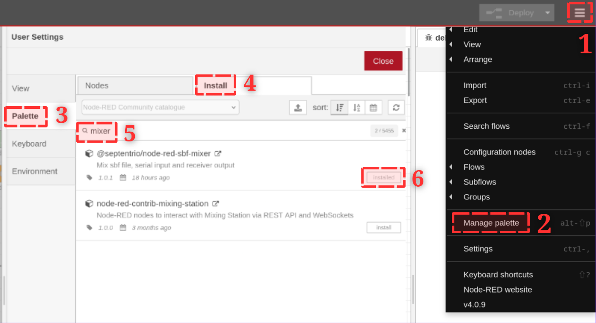
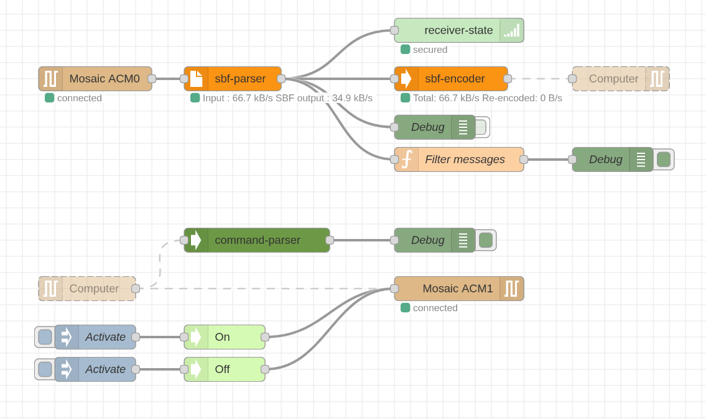
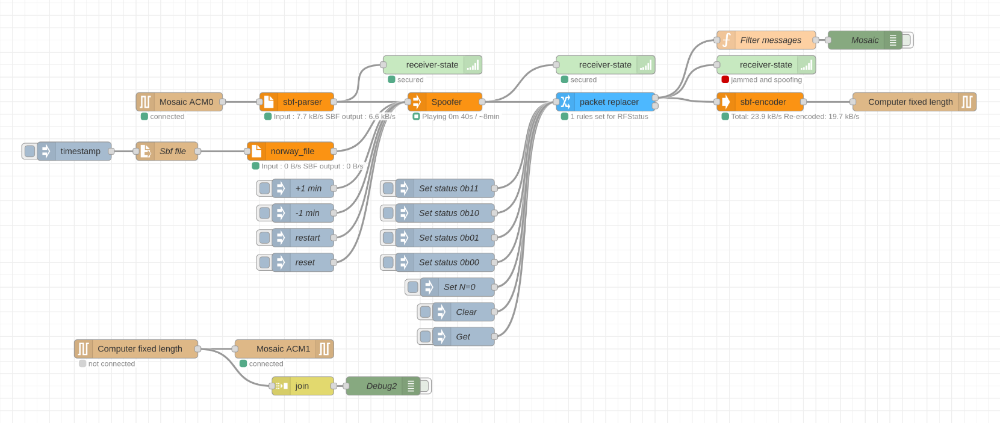
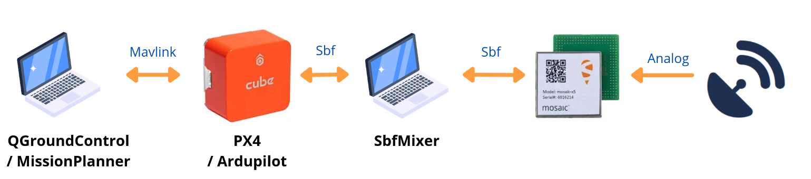
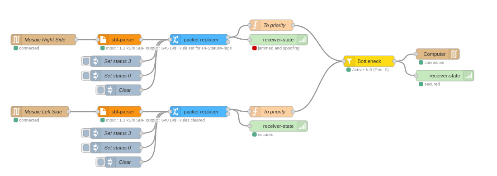

# Using SbfMixer - The Complete Guide

In this tutorial, we will see how to use SbfMixer from A to Z:

1) Install SbfParser
2) Install SbfMixer
3) Connect to the Septentrio receiver
4) Modify SBF blocks
5) Connect SbfMixer to another output (Autopilot, base station)
6) Example: CRPA
7) NPM CheatSheet

# Tutorial
## Install SbfParser

SbfMixer uses [SbfParser](https://pypi.org/project/sbf-parser/) to decode and encode SBF streams.
To install it, you can use pip: `pip install sbf-parser`
If you are using a Python virtual environment, remember to activate your environment before running node-red.

## Install SbfMixer
### With Node-RED palette

Once node-red is installed, you can run it with `node-red` then navigate to [http://127.0.0.1:1880](http://127.0.0.1:1880).
You can now install SbfMixer by going to:
Menu > Manage Palette > Palette > Install > Search for "mixer" > Install `@septentrio/node-red-sbf-mixer`

You must also install `node-red-node-serialport`




### With command line

You can also install the dependencies with the following commands:
With `npm`:
```bash
cd ~/.node-red
npm install @septentrio/node-red-sbf-mixer
npm install node-red-node-serialport
```

If you want to install directly with the source code to test your modifications, you can use:
```bash
cd ~
git clone https://github.com/septentrio-gnss/SbfMixer
cd ~/.node-red
npm install ~/SbfMixer
```
You must restart node-red after each modification made to the SbfMixer source code for it to be taken into account.


## Connect to the Septentrio receiver

Start by connecting your Septentrio receiver to your computer using a USB cable.
You should be able to access your GPS interface via the following URL: [https://192.168.3.1/](https://192.168.3.1/)

Now, import the flow `read_stream.json` by clicking on Menu > Import (Ctrl + i).



This flow consists of two parts. The upper part allows reading information transmitted by the receiver and is composed as follows:
- Reading information on the ACM0 serial connection
    - You must specify the name of your serial connection as well as a baud rate of 115200.
    - Input needs to be sent as soon as they are decoded. Hence, the "Split input into fixed length of ' '" (empty = 1).
    - On limited hardware, you can try after a timeout of 10ms or with bigger chunks, but this can add delay or disrupt connection if you are between two devices communicating together through SbfMixer. (Autopilot <-> SbfMixer <-> Septentrio receiver)

- The blocks will then be decoded using SbfParser
    - This block allows you to visualize the input bandwidth and the bandwidth of decoded SBF blocks. A gap between the two will mean that certain data (NMEA, RTCM) is not decoded but their binary will still be transmitted.
    - You can double-click on the parser to give it a name, this allows you to know the origin of the message when several parsers are combined together (cf: spoofer or bottleneck)

- The information is then displayed
    - ReceiverState will display the presence of jamming or spoofing, as well as the presence of a connection to an SBF receiver
    - The first debug will display all messages, you can disable it by clicking to its right if there is too much information for the debug window. You will probably need to wait a bit for the display of all messages to take effect before this happens
    - The "filter message" function allows you to transmit only certain messages, useful for debugging

- Then re-encoded
    - If you have modified information in an SBF block, we need to re-encode it to update it
    - By default, unmodified blocks are directly transmitted using the payload property of decoded blocks. If you modify a block, you must therefore delete the payload field from the message.
    - The block will display the bandwidth of transmitted and re-encoded messages.

- And transmitted as output: The information can then be transmitted to an autopilot (Ardupilot, PX4, etc...) or to any other tool

## Modify SBF blocks

Let's take the example of an interference simulator that will modify packets transmitted by the Septentrio receiver to make it believe there is a presence of jamming and/or spoofing.



You can modify SBF blocks in 2 different ways.
### Spoofer
This block will take SBF blocks from one parser to substitute them with those from another parser.
To do this, you must specify the name of the parser that will give the parser the values of messages to substitute, here we have an extract from a recording made in Norway with jamming and spoofing tested in real conditions.

The spoofer will start modifying packets as soon as the first block from another parser is received.
Only SBF blocks will be modified, the value of a block will take the most recent value of the same type block available in the recording.

### Packet replacer
This block allows you to modify block values manually. To do this, you simply need to send a message to this block containing: `{command:"set", blockName:"MyBlockName"}`, for example `blockName:"ReceiverStatus"`. All other fields will be considered as rules that will be applied to blocks matching the blockName.

You can also use a `function` block to do custom operations, but this block will allow you to easily change values by sending it messages without the need to re-deploy your flow.

If you notice that the encoder can no longer encode or you have warnings like:
```
[warn] [sbf-encoder:b66abd98f1a8cc89] Python encoder error",
  File "sbf_parser/encoder.pyx", line 154, in sbf_parser.encoder.encode
  File "sbf_parser/encoder.pyx", line 118, in sbf_parser.encoder.encode
  File "sbf_parser/encoder.pyx", line 213, in sbf_parser.encoder._handle_complex_block
  File "sbf_parser/encoder.pyx", line 204, in sbf_parser.encoder._serialize_block
struct.error: required argument is not an integer
```
This means you have probably modified a message with a value of a different type than the original one, so the block cannot be re-encoded.
For this, make sure that the type in your inject node is correct, most often, an integer or a float.


## Connect SbfMixer to another output (Autopilot, base station)

You can use SbfMixer as middleware between your receiver and another application (Autopilot, Base station, software, etc...).



This setup will allow you to directly analyze communications and be able to modify them on the fly.
To do this, if you previously used a [JST](https://customersupport.septentrio.com/s/article/How-to-integrate-latest-Septentrio-receivers-with-PX4-autopilot-using-Pixhawk-standard-boards) cable, you will need to use a [TTL-234X-5V](https://www.google.com/search?client=firefox-b-d&sca_esv=000223f181a12c46&q=TTL-234X-5V&udm=2&fbs=AIIjpHxU7SXXniUZfeShr2fp4giZ1Y6MJ25_tmWITc7uy4KIegMOm3ItDJ-cT-Q5w0bTw0aWDUsQli3okTHBRSgORXy6CJUQc5sVHi-huEHnZn--lXeI5cOKb8xaiaZN98RZ8FshAoaS4PtnoCKohGCXSsG3bp_VbIK8PnkxyWVWwWqyBopz3rD3o3H-MSgFM3SfENhHrzq9&sa=X&ved=2ahUKEwjUhJiq2pGOAxUMRaQEHZTnJdUQtKgLKAF6BAgSEAE&biw=1969&bih=967&dpr=2) cable allowing you to emulate a serial connection on your computer.

If you previously used a USB cable to connect your GPS receiver to a computer, you will then need two. Indeed, the Mosaic-H receiver emulates a serial connection via USB when you connect it to your computer, which explains why you can read a data stream on the serial connection `/dev/ttyACM0`. You must then transform the stream from SbfMixer into a data stream on your computer's serial connection, then decode it on your second computer, hence the two TTL cables.

To do this, you must use the serial out node block.

## Example: CRPA

SbfMixer also allows you to combine several streams from different Septentrio receivers transparently for your applications.
For this, you can use the Bottleneck block which will let the parser stream with the highest priority pass through.



For this, you can use a block that will handle updating the priority based on the messages it receives:
```js
if (msg.blockName == "RFStatus") {
    const flags = msg.block["Flags"]
    let priority = 10;

    if (flags & 0b01) { // Jamming detected
        priority -= 1;
    }

    if (flags & 0b10) { // Spoofing detected
        priority -= 1;
    }

    const msg_priority = {
        "_parsed_by": msg._parsed_by,
        "command": "set",
        "priority": priority
    }

    return [[msg_priority, msg]];
}else{
    return msg;
}
```

## NPM CheatSheet

- `npm list`: List installed packages - You can do it in your home or in `~/.node-red` folder.
- `npm install my_folder_with_package_source`
- `npm install @septentrio/node-red-sbf-mixer`
- `npm uninstall <package_name>`
- `npm publish --access public`: Update the package version in `package.json` before, only needed by Septentrio maintainer


