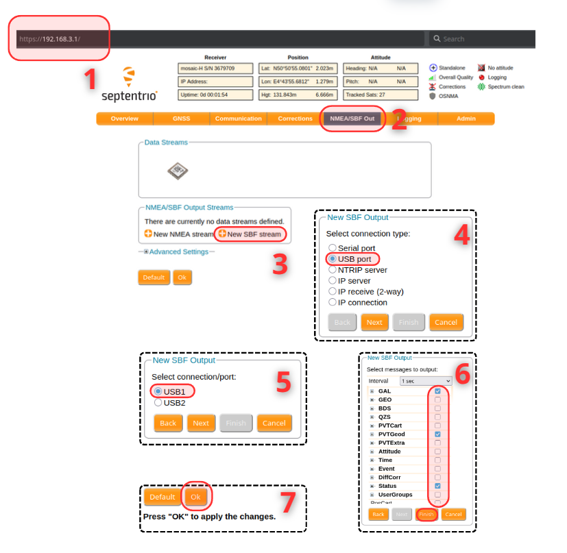

full_tutorial.md

npm install node-red-node-serialport

# Utiliser SbfMixer - Le guide complet

Dans ce tutoriel, nous allons voir comment utiliser SbfMixer de A à Z :

1) Configurer le recepteur Septentrio
2) Installer SbfMixer
3) Connecter SbfMixer au recepteur GPS
4) Décoder les blocks SBF 
5) Modifier des blocks SBF
6) Connecter SbfMixer a une autre sortie (Autopilot, base station)
7) Example : Spoofer
8) Example : CRPA

# Tutoriel
## Installer SbfParser

SbfMixer utilise [SbfParser](https://pypi.org/project/sbf-parser/) pour décoder et encoder les flux sbf.
Pour l'installer, vous pouvez utiliser pip : `pip install sbf-parser`
Si jamais vous utilisez un environnement virtuel python, pensez à activer votre environnement avant d'éxécuter node-red.

## Installer SbfMixer
### With Node-RED palette

Une fois node-red installé, vous pouvez l'éxécuter avec `node-red` puis vous rendre sur [http://127.0.0.1:1880](http://127.0.0.1:1880).
Vous pouvez maintenant instller SbfMixer en allant sur :
Menu > Manage Palette > Palette > Install > Search for "mixer" > Install `@septentrio/node-red-sbf-mixer`

Vous devez aussi installer `node-red-node-serialport`


### With command line

Vous pouvez aussi installer les dépendances avec les commandes suivantes :
Avec `npm` :
```bash
cd ~/.node-red
npm install @septentrio/node-red-sbf-mixer
npm install node-red-node-serialport
```

Si vous voulez installer directement avec le code source pour tester vos modifications, vous pouvez utiliser :
```bash
cd ~
git clone https://github.com/septentrio-gnss/SbfMixer
cd ~/.node-red
npm install ~/SbfMixer
```
Vous devez relance node-red à chaque modifications apporté au code source de SbfMixer pour que celui-ci soit pris en compte.


## Se connecter au receiver Septentrio

Commencez par brancher votre receiver Septentrio à votre ordinateur en utilisant uyn cable usb.
Vous devriez pouvoir accèder à l'interface de votre GPS via l'url suivante : [https://192.168.3.1/](https://192.168.3.1/)

Maintenant, importer le flow `read_stream.json`en cliquant sur Menu > Import (Ctril + i).


Ce flow ce compose en deux partie, la partie supérieur permet de lire les informations transmises par le récepteur et ce compose comme suit :
- Lecture des informations sur le connection serie ACM0
    - Vous devez renseigner le nom de votre connexion serial ainsi qu'un baud rate of 115200.
    - Input need to be send as soon has they decoded. Hence, the "SPlit input into fixed length of ' '" (empty = 1).
    - On limited hardware, you can try after a timeout of 10ms or with bigger chunk, but this can add delay and disrupt connection if you are beetwen two device communicating together (Autopilot <-> SbfMixer <-> Septentrio receiver)

- Les blocks vont ensuite être décodés en utilisant SbfParser
    - Ce block permet de visualiser la bande passante en entrée et la bande passante des blocks sbf décodées. Un écart entre les deux signifiera que certainnes données (NMEA, RTCM) ne sont pas décodés mais leur binaire sera tout de même transmis.
    - Vous pouvez double cliquer sur le parser pour lui donner un nom, cela permet de savoir l'origine du message quand plusieurs parser sont combinés ensembles (cf: spoofer or bottleneck)

- Les informations sont ensuites affichés
    - ReceiversState affichera la présence de jamming ou de spoofing, ainsi que la présence d'une connection à un recepteur SBF
    - Le premier debug affichera tout les messages, vous pouvez le désactiver en cliquant à sa droite si cela fait d'information pour la fenetre de debug. Il faudra surement attendre un peu que l'affichage de tout les message se fasses avant que cela ne prenne effet
    - La fonction "filter message" permet de ne transmettre que certains messages, pratique pour débugger

- Puis ré-encodée
    - Si jamais vous avez modifié des informations dans un bloc sbf, nous devons le ré-encoder pour le mettre à jour
    - Par défaut, les blocks non-modifiés sont directement transmis en utilisant la propriété payload des block décodés. Si jamais vous modifiez un block, vous devez donc supprimer le champ payload du message.
    - Le bloc affichera la bande passante des messages tranmis et ré-encodés.

- Et transmis en sortie : Les informations peuvent ensuite être trnamises à un autopilot (Ardupilot, PX4, etc ...) ou à n'importe quelle autre outils

## Modifier des blocks SBF

Prenons l'exemple d'un simulateur d'interferance qui va modifier les paquets transmis par le recepteur Septentrio pour faire croire qu'il y a une présence de jamming et/ou de spoofing.


Vous pouvez modifier les blocks sbf de 2 manière différentes.
### Spoofer
Ce block va prendre les blocks sbf d'un parser pour les substitué avec ceux d'un autre parser.
Pour ce faire, vous devez préciser le nom du parser qui donnera au parser les valeurs des messages à substituer, ici nous avons un extrait d'enregistrement réaliser en Norvège avec du jamming et spoofing testé en condition réel.

Le spoofer commencera à modifier les pacquets dès le premier block venant d'un autre parser reçu.
Seul les blocks sbf seront modifiés, la valeur d'un block prendra la valeur la plus récente du block de même type disponible dans l'enregistrement.

### Packet replacer


## Connecter SbfMixer a une autre sortie (Autopilot, base station)
## Example : Spoofer
## Example : CRPA

## Configurer manuellement un recepteur Septentrio
Notre première étape est de connecter notre récepteur Septentrio à notre ordinateur qui utilisera SbfMixer. Pour cela, utilisez un cable usb C (ou usb-micro selon le cas) que vous allez brancher à votre ordianteur.
Pour vérifier que le récepteur GPS est bien détecté, rendez-vous à l'adresse https://192.168.3.1/, vous devriez avoir le dashboard suivant :

Image dashbaord

Maintenant, vous devez configurer votre récepteur pour qu'il output des informations. Pour cela :
1) Go to https://192.168.3.1/ to enable the output of some SBF messages
2) Go to NMEA/SBF Out
3) Click New SBF Stream
4) Select USB Port
5) Select USB1
6) Choose your messages to output, for example, Status, PVTGeod and GAL
7) Confirm with Ok



Vous devrier maintenant avoir une sortie USB1 comme suit au niveau de Data Stream


Maintenant que votre récepteur envoie des données via USB, vous pouvez vérifier sur votre ordinateur que vous les recevez bien.
Pour ce faire, vous pouvez utiliser sous linux cat name_of_your_serial_connection (le plus souvant /dev/ttyACM0). Vous devrier obtenir un affichage comme suit avec des $@ signifiants le début de blocks SBF.

Image

## NPM 
### List npm package

npm list

You can do it in your home (~) or in ~/.node-red folder.

### Install package

Go to the ~/.node-red and then :

npm install my_folder_with_package_source
npm install @septentrio/node-red-sbf-mixer

### Remove npm package

npm uninstall <package_name>
